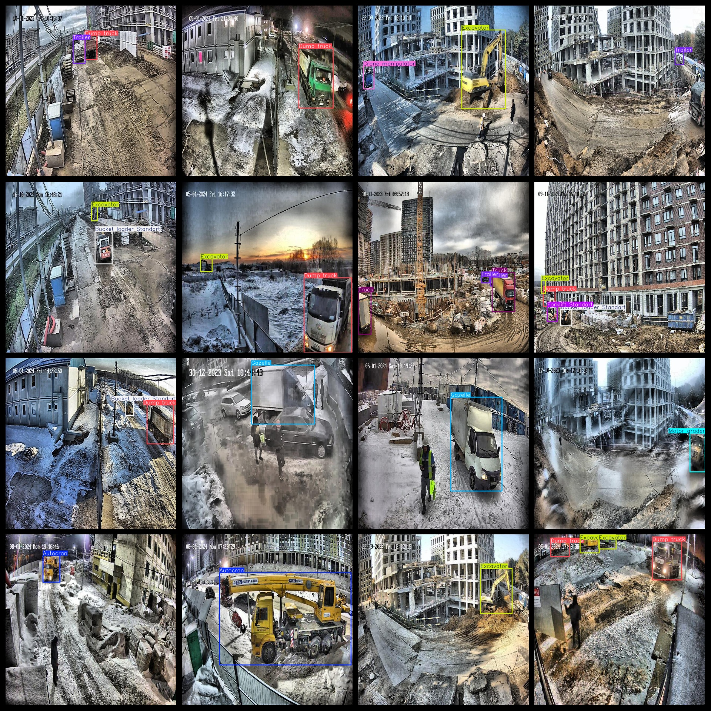

# Camera View Engineering Vehicle Heavy Machinery Dataset 16985 images VOC+YOLO format

The dataset is in Pascal VOC format + YOLO format, without split paths in txt files. It only includes jpg images and their corresponding VOC format xml files and yolo format txt files.

Image Count (jpg Files): 16985
Annotation Count (xml Files): 16985
Annotation Count (txt Files): 16985
Number of Annotation Categories: 17
Repository: datasets_sl

The number of categories in the labels file (noting that the order of categories in the yolo format does not match this, but is based on the "labels" folder's "classes.txt"): ["Autocran", "Bucket loader Big", "Bucket loader Standart", "Bulldozer", "Cleaning equipment", "Crane manipulator", "Dump truck", "Excavator", "Forklift Giraffe", "Forklift Standart", "Gazelle", "Mixer", "Motor grader", "Roller", "Tanker", "Trailer", "Truck"]

Each category has its own number of bounding box boxes:
- Autocran: 1789 boxes
- Bucket loader Big: 2447 boxes
- Bucket loader Standart: 2362 boxes
- Bulldozer: 1 box
- Cleaning equipment: 854 boxes
- Crane manipulator: 806 boxes
- Dump truck: 6942 boxes
- Excavator: 8217 boxes
- Forklift Giraffe: 705 boxes
- Forklift Standart: 959 boxes
- Gazelle: 4770 boxes
- Mixer: 1224 boxes
- Motor grader: 665 boxes
- Roller: 21 boxes
- Tanker: 414 boxes
- Trailer: 1775 boxes
- Truck: 1305 boxes
Total Boxes: 35256

Each category has its own number of images:
- Autocran: 1789 images
- Bucket loader Big: 2420 images
- Bucket loader Standart: 2346 images
- Bulldozer: 1 image
- Cleaning equipment: 854 images
- Crane manipulator: 771 images
- Dump truck: 5904 images
- Excavator: 6760 images
- Forklift Giraffe: 682 images
- Forklift Standart: 918 images
- Gazelle: 3997 images
- Mixer: 1180 images
- Motor grader: 663 images
- Roller: 21 images
- Tanker: 408 images
- Trailer: 1380 images
- Truck: 1255 images
Image resolution: 640x640
Used LabelImg for annotating the dataset. No data enhancement was applied to this dataset.
Training, validation, testing splits are required to be performed by the user.
This dataset does not guarantee any accuracy in model training or weight file precision.
Annotation and image details are as follows:

## Images

---

Here is a pay link on Stripe (https://buy.stripe.com/3cs8yP7sY87d0vu9AB). Please contact me lonlonago@foxmail.com after funding $89, and I will send you a complete data files, thank you!

